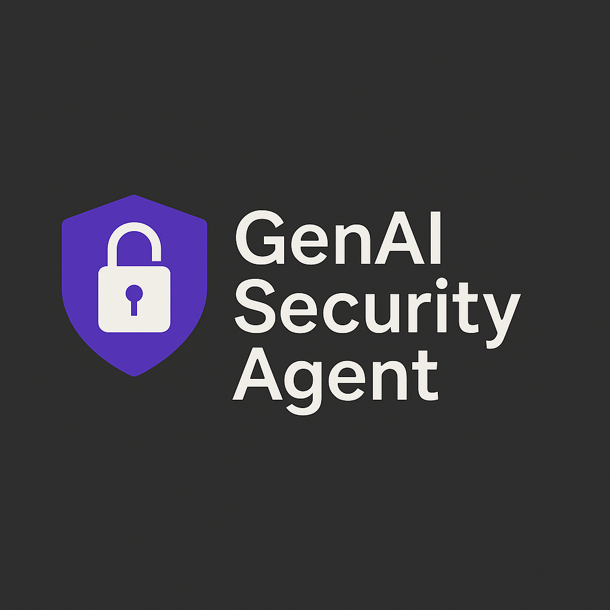
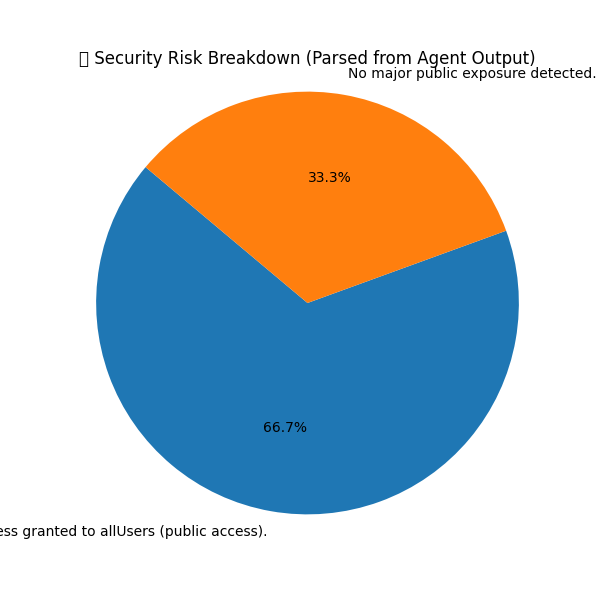

# 🛡️ GenAI Security Agent – Capstone 2025

A Generative AI-powered assistant that detects, interprets, and provides real-time remediation recommendations for cloud security misconfigurations using function calling, severity scoring, and simulated LangGraph workflows.

## 🔍 What This Project Demonstrates

- Prompt engineering with Gemini and simulated LangGraph agents
- Misconfiguration detection in IAM policies and firewall configs
- Severity scoring and risk classification
- Real-time grounding via SerpAPI for dynamic remediation tips
- Automated reports in Markdown, PDF, and HTML formats

## 📁 Repository Structure

```
/
├── Assets/
│   ├── genai_security_logo.png
│   └── risk_breakdown_chart.png
├── Notebook/
│   └── genai-security-agent-capstone-2025-yuwan.ipynb
├── Reports/
│   ├── Security_Misconfig_Report.md
│   ├── Security_Misconfig_Report.pdf
│   └── Security_Misconfig_Report.html
```

## 🧪 Technologies Used
- Gemini Pro (simulated)
- Python (LangGraph simulation)
- SerpAPI (real-time search grounding)
- Matplotlib, Counter, FPDF
- Markdown, HTML, PDF exports

## 🪄 Enhancements (Future Work)
- Integrate with live IAM and GCP log data
- Connect to dashboards (ELK, Splunk)
- Full LangGraph integration

## 🧑‍💻 Creator
Created with purpose by **Yuwanthiran Sukalingam (Yuwan)**  
🎯 Vision: Secure AI-powered infrastructure for DevSecOps, SecOps, and Compliance.

## 📸 Logo Preview  


## 📊 Risk Breakdown Sample  


## 🔖 Submission Hashtags
`#genai-security`, `#cloud-misconfig-detection`, `#kaggle-ai-capstone`, `#langgraph`, `#gemini`, `#secops`, `#yuwan`
